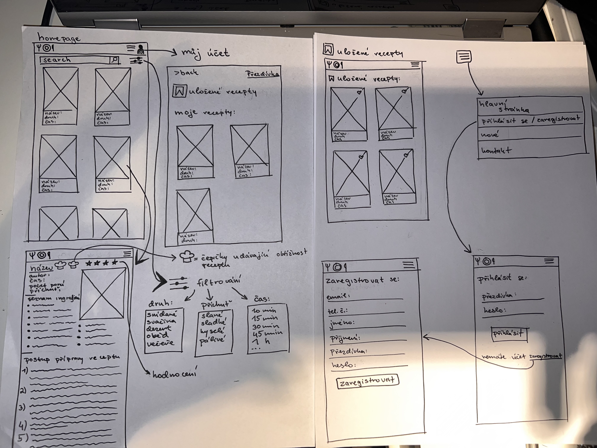

# 2024_wt_prj_bursova
Databáze receptů je webová aplikace určená pro organizaci a sdílení kuchařských receptů.

V administraci se spravuje databáze receptů. Každý recept obsahuje název, jméno autora, seznam ingrediencí, postup přípravy, čas přípravy, počet porcí, druh (snídaně, oběd, dezerty, večeře, svačina), obtížnost, příchuť (slané, sladké, hořké, pálivé, kyselé) a hodnocení. Registrovaní uživatelé mohou přidávat vlastní recepty, ukládat oblíbené recepty a hodnotit recepty ostatních uživatelů pomocí systému hvězdiček (1–5).

Na hlavní stránce se zobrazuje seznam receptů, který lze filtrovat podle druhů, příchutí nebo času přípravy. Seznam receptů tvoří kartičky, na kterých je název receptu, druh a čas přípravy. Kliknutím na kartičku se zobrazí detail receptu s kompletními informacemi, jako jsou ingredience, postup, obtížnost a hodnocení.

Hlavní menu obsahuje odkaz na hlavní stránku, přihlášení/zaregistrování, nejnovější recepty a kontakt na spravovatele stránky. Na hlavní stránce je možnost vyhledávání, která umožňuje fulltextové hledání podle názvu nebo popisu receptu. 

 ## Wireframes

